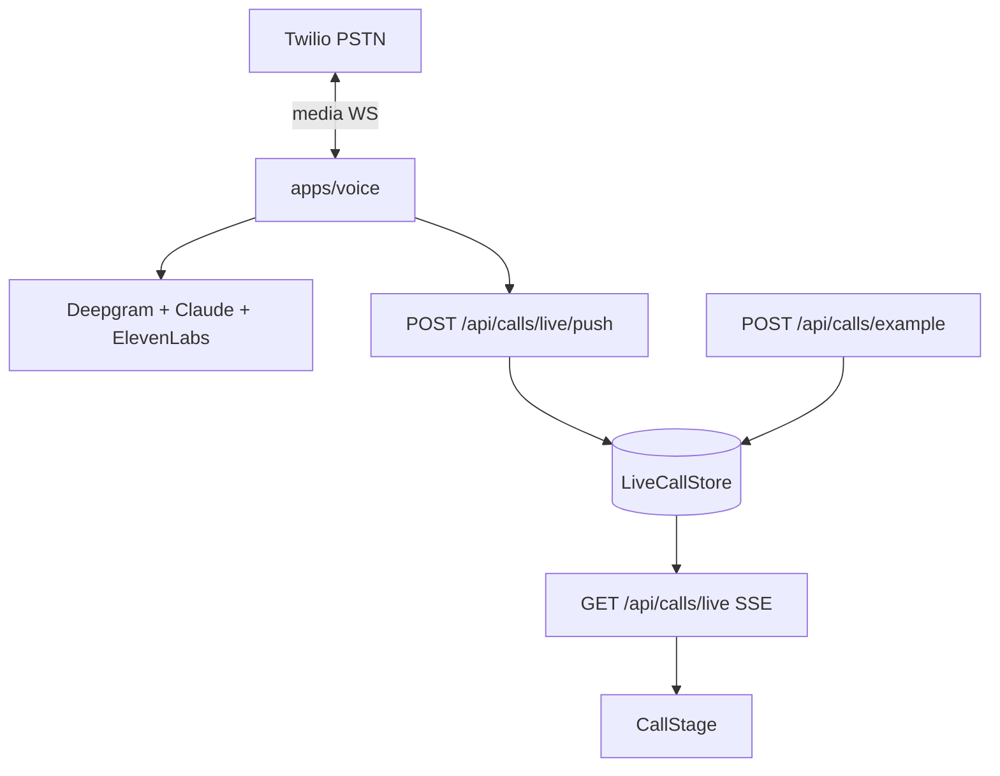

# Pulse

Phone agent demo: Twilio for the call, Next.js at `/` for the UI.

`/` shows the number, two recorded samples (normal order + allergy question where the agent declines to guess), and one transcript panel. Samples and live calls use the same SSE stream and `CallStage`.

**Open issue:** SSE transcript works; **caller still hears silence on PSTN** (outbound audio). Debug notes: [`apps/voice/README.md` § PSTN outbound audio](apps/voice/README.md#pstn-outbound-audio).

## Architecture

**Call path:** Twilio PSTN ↔ **`apps/voice`** over a WebSocket media stream. Per turn: **Deepgram** (STT) → **Claude** with tools in `apps/voice/src/brain/tools.ts` (`say`, `lookup_menu_item`, `add_to_cart`, `transfer`, `end`) → **ElevenLabs** (TTS) back toward Twilio.

**Transcript path (parallel):** `apps/voice/src/live-push.ts` POSTs each lifecycle/turn event to **`apps/web`** `POST /api/calls/live/push` → **`LiveCallStore`** in `apps/web/lib/live-calls.ts` (in-memory, one Next process / region). The browser subscribes with **`GET /api/calls/live`** (SSE); **`CallStage`** renders both live calls and sample playback.



**Sample calls:** `POST /api/calls/example` with `{ scenario }` — reads `public/example-calls/<scenario>.json`, schedules the same turn events into `LiveCallStore`, plays `<scenario>.mp3` in the browser. No Twilio involved.

**Key files:** `apps/web/app/page.tsx`, `apps/web/components/voice/CallStage.tsx`, `apps/web/lib/live-calls.ts`, `apps/voice/src/server.ts`, `apps/voice/src/orchestrator.ts`, `apps/voice/src/live-push.ts`.

**Data:** Postgres (`packages/schema`, `infra/drizzle`) — tenant + menu for the voice agent boot path. After migrate, `pnpm seed:voice` once.

## Security

1. **Tenant data:** Postgres RLS via `app.tenant_id`; use `withTenant` / `withAdmin`. Do not disable RLS to debug — use `SET LOCAL app.tenant_id = '<uuid>'`. Policies in `packages/schema/src/rls.ts`.
2. **Secrets:** Never commit `.env*`. Rotate if leaked.
3. **Gate:** `DEMO_PASSWORD` + `DEMO_COOKIE_SECRET` (middleware HMAC). Misconfig should fail closed (503), not open.
4. **Live push:** `POST /api/calls/live/push` requires `Authorization: Bearer <LIVE_CALLS_PUSH_TOKEN>` when set; gate bypasses this route so the voice server can push without a session cookie.
5. **Prompt injection:** Caller text stays out of the system prompt slot (`AGENTS.md`).

No durable storage of call audio or full transcripts on the shipped path. Do not log raw audio to public URLs. Recording, consent, and two-party law are your problem if you scale this up.

## Repo layout

```
apps/
  web/              Next.js — single page at /, password gate, SSE + CallStage
  voice/            Twilio + Deepgram + Claude + ElevenLabs; see apps/voice/README.md
packages/
  schema/           Zod + Drizzle, RLS, tenant/menu for voice
  telemetry/        llm.call() — all LLM traffic from apps/voice goes here
scripts/
  example-calls.ts  Builds public/example-calls/*.mp3 + .json
infra/              drizzle migrations, docker-compose Postgres
```

Agent rules + change recipes: [`AGENTS.md`](AGENTS.md). Voice env, deploy, PSTN: [`apps/voice/README.md`](apps/voice/README.md).

## Running it

Requirements: Node 22+, pnpm 10+, Docker for local Postgres.

```bash
pnpm install
cp .env.example .env               # fill in keys; minimum below
docker compose -f infra/docker-compose.yml up -d
pnpm db:migrate
pnpm seed:voice                    # tenant + menu
pnpm check                         # typecheck + lint (+ RLS tests need DB up)
pnpm dev                           # Next :3000 + voice :8788
```

Open <http://localhost:3000>, pass the gate, use the two sample calls or dial the number.

`pnpm check` runs `packages/schema/tests/rls.test.ts` against Postgres. If you see `ECONNREFUSED`, start Docker or run check in CI with a DB.

**Sample calls:** Same SSE path as live calls. Build assets once: `pnpm example-calls:build`.

**Live (deployed):** Voice on Railway, web on Vercel with root `apps/web`. Steps: [`apps/voice/README.md`](apps/voice/README.md#railway-deploy).

**Live (local):** Same `LIVE_CALLS_PUSH_TOKEN` in both apps; ngrok `8788`; Twilio webhook → `https://<ngrok>/twilio/voice`; `.env` has `PUBLIC_BASE_URL` + `WEB_BASE_URL`.

```bash
ngrok http 8788
# Twilio "A call comes in" → https://<id>.ngrok.app/twilio/voice
# In .env: PUBLIC_BASE_URL=https://<id>.ngrok.app  WEB_BASE_URL=http://127.0.0.1:3000
pnpm dev                           # or pnpm dev:web / pnpm dev:voice
```

### Minimum env (web + voice)

| Key                     | Why                                                                        |
| ----------------------- | -------------------------------------------------------------------------- |
| `DEMO_PASSWORD`         | Password gate.                                                             |
| `DEMO_COOKIE_SECRET`    | HMAC for gate cookie. 32+ byte random string.                              |
| `TWILIO_PHONE_NUMBER`   | Shown on homepage. Cosmetic if voice is not deployed.                     |
| `LIVE_CALLS_PUSH_TOKEN` | Bearer for `/api/calls/live/push`; required in public/prod.               |
| `ANTHROPIC_API_KEY`     | Voice only — Claude per-turn.                                              |
| `DEEPGRAM_API_KEY`      | Voice only — streaming STT.                                                |
| `ELEVENLABS_API_KEY`    | Voice only — TTS + `pnpm example-calls:build`.                            |
| `ELEVENLABS_VOICE_ID`   | Voice only.                                                                |
| `TWILIO_ACCOUNT_SID`    | Voice only.                                                                |
| `TWILIO_AUTH_TOKEN`     | Voice only — verify Twilio webhooks in production.                         |
| `DATABASE_URL`          | After `pnpm db:migrate`.                                                   |
| `PII_ENCRYPTION_KEY`    | Reserved if encrypted PII rows are used later.                            |
| `PUBLIC_BASE_URL`       | URL Twilio reaches for voice (default `http://127.0.0.1:8788` local).     |
| `WEB_BASE_URL`          | Next origin for push (default `http://127.0.0.1:3000`).                   |

After a fresh DB: `pnpm seed:voice` once for `tonys-pizza-austin` + menu.

Before you call it done: `pnpm check`. Format if you touched style: `pnpm format`.

## License

Unlicensed.
